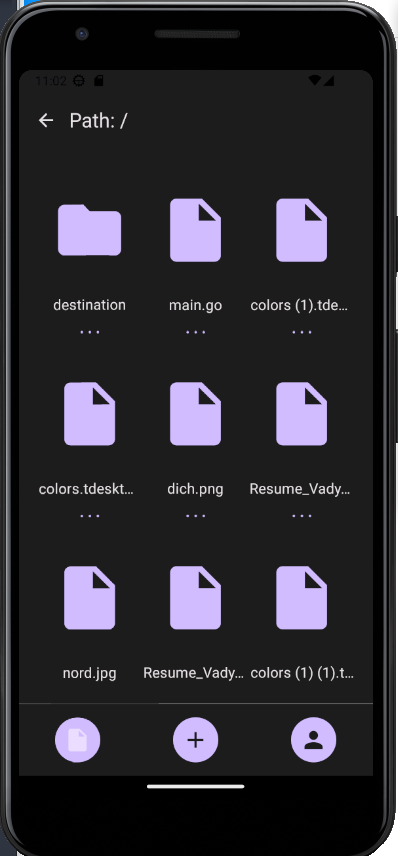
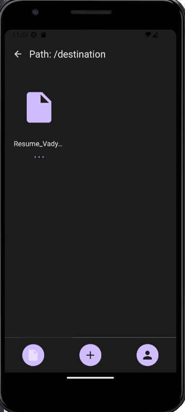
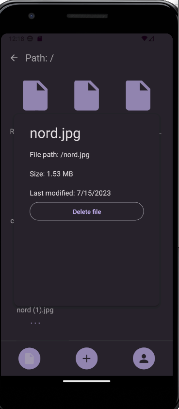
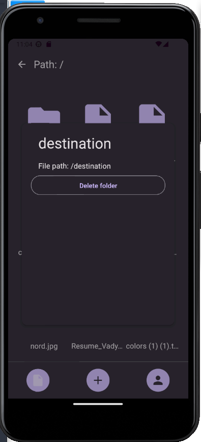
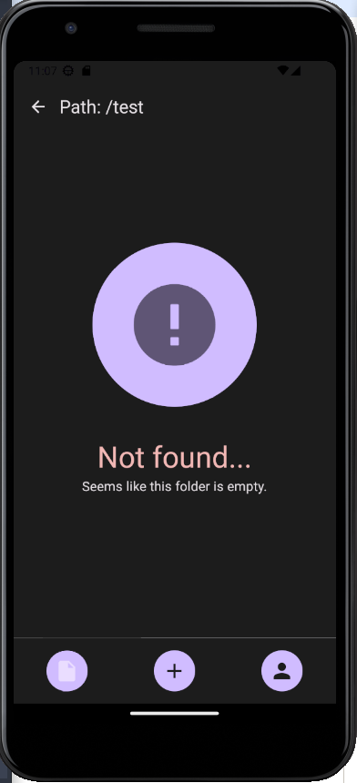
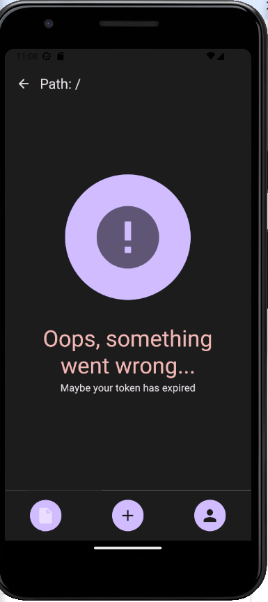
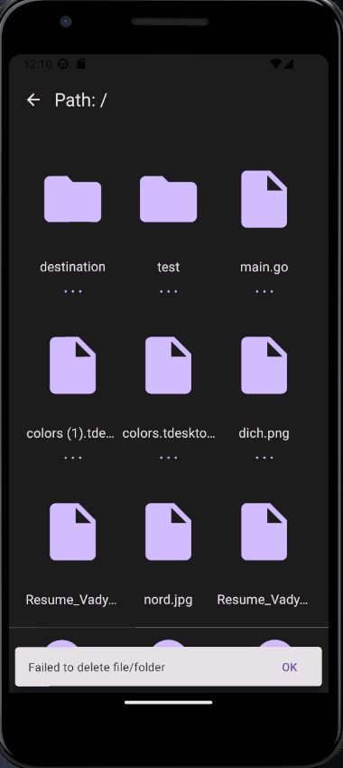

# Test task for the DBB Software

## TL;DR

- Ensure you have node.js **18.6.0** installed
- Ensure you have expo installed
- Run `npm install` in your terminal from the root of the project
  - **Optional**: Run `npm run lint` to lint the project
  - **Optional**: Run `npm run format` to format the code
- Ensure you've specified all the needed variables in your `.env` file. There's an example of all the required variables in `.env.example`
- Start the app with following command: `npx expo start`
  - **NOTE**: After you've changed something in `.env` file there can be a chance that old variables is still cached. So you need to run `npx expo start --clear` instead.
  - **NOTE**: If you ran into the problem, that your API calls fail, you should check whether the your provided token not expired & you cleaned the cache.

## Documentation

### Tech stack:

- React Navigation
- React Native Paper(component library)
- Redux & Redux toolkit

### Project structure

`design` folder contains all the UI components without logic, which can be easily reused across the application. Also it contains theme configuration as well.

`lib` folder contains the utility functions, such as wrapper around the `fetch`, format functions etc.

`screens` folder contains screens(pages) of the application.

`modules` folder contains all the business related components with the logic and store as well.

## Photos of the application:

